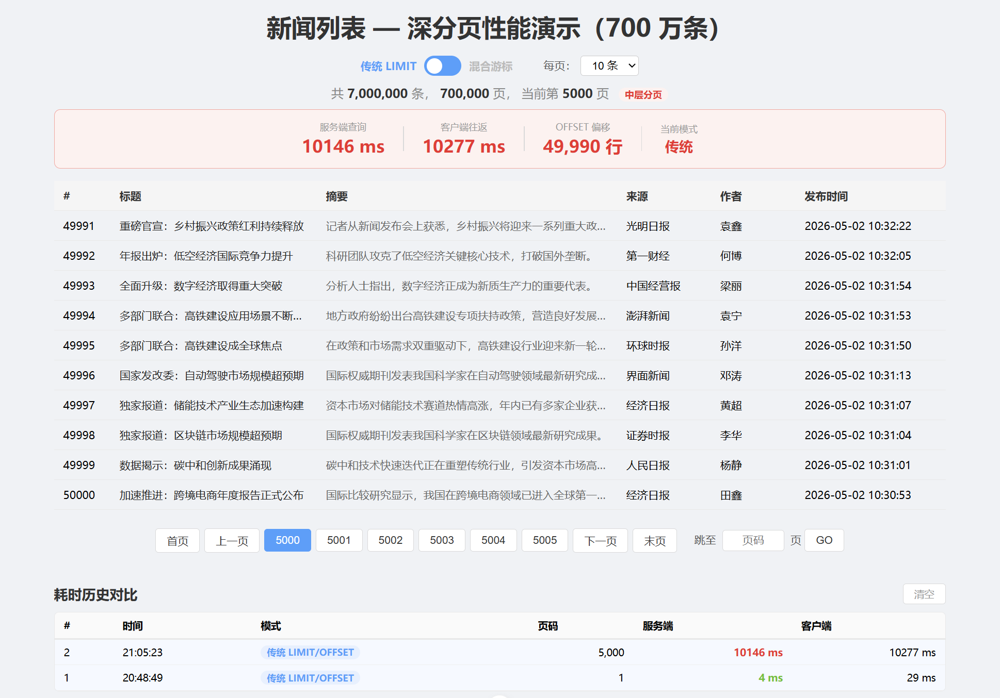
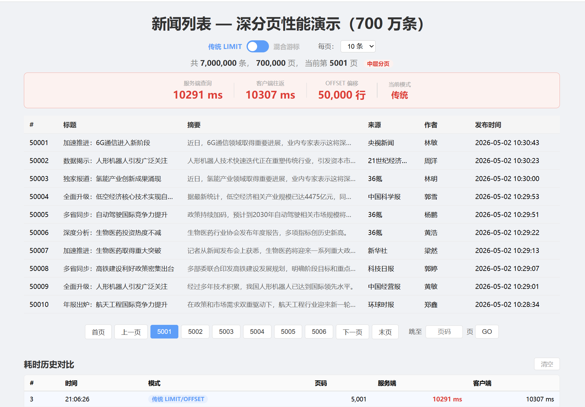
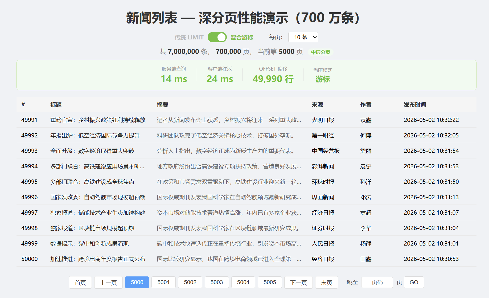
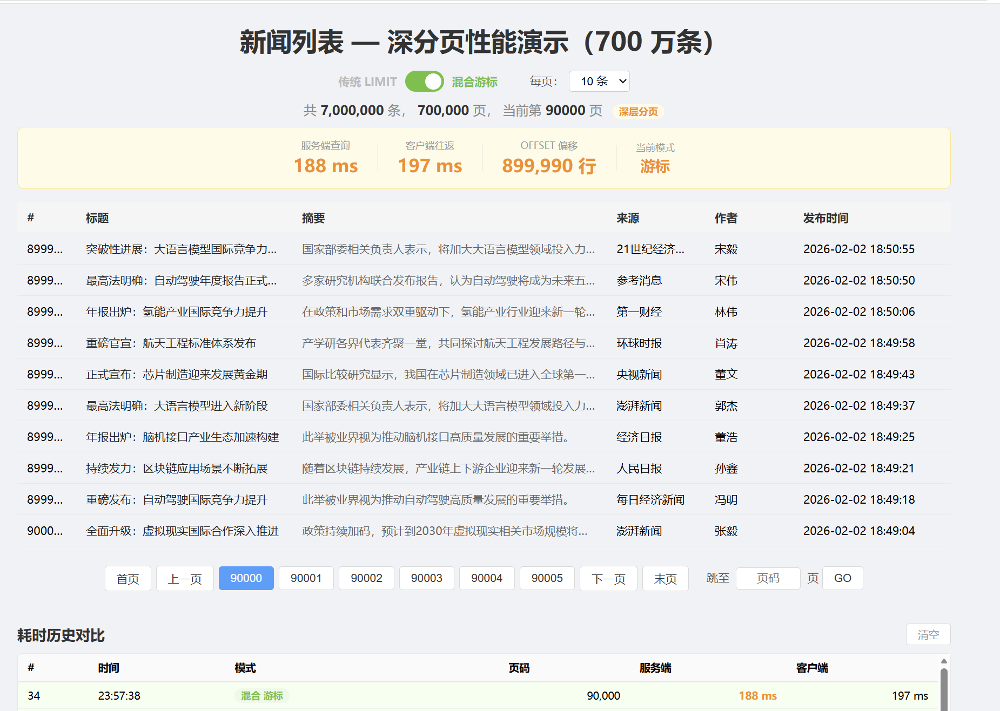
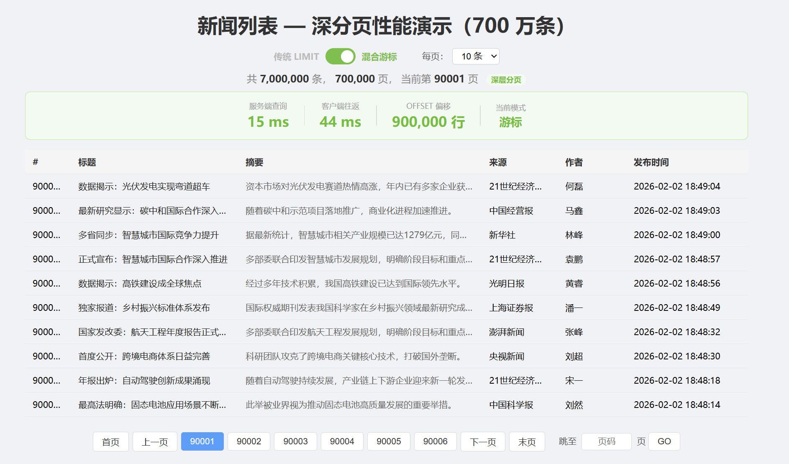
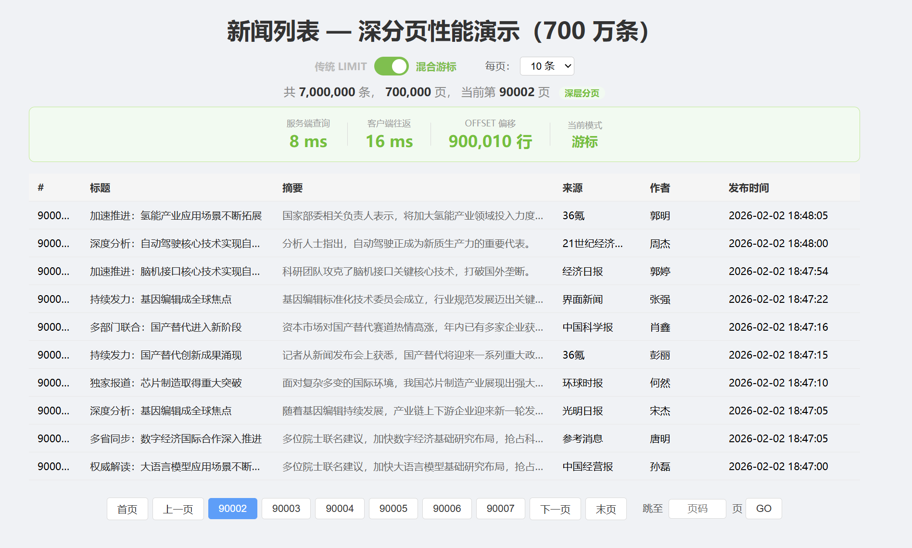
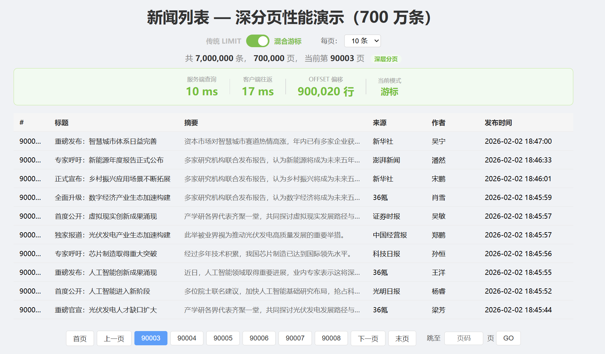

# 用户使用翻页功能查到5000页时延迟超高？延迟关联+游标分页优化一下深度分页

## 快速启动

### 前置条件

- JDK 17+（或与项目当前配置兼容的版本）
- Maven 3.8+
- MySQL 8.x
- Node.js 20.19+ 或 22.12+

### 1) 准备数据库

1. 创建数据库 `page_demo`。
2. 执行 [src/main/resources/init.sql](src/main/resources/init.sql) 建表。
3. 按需修改 [src/main/resources/application.yml](src/main/resources/application.yml) 中的数据库账号密码。

### 2) 启动后端

在项目根目录执行：

```bash
mvn spring-boot:run
```

说明：应用启动时会自动生成 7000000 条新闻数据（见 `DataInitializer`），首次启动需要较长时间，请耐心等待。

后端默认地址：`http://localhost:8080`

### 3) 启动前端

进入前端目录并安装依赖：

```bash
cd frontend-vue3/page-demo
npm install
```

启动开发服务器：

```bash
npm run dev
```

前端默认地址：`http://localhost:5173`

### 4) 验证接口

前端默认请求后端：`http://localhost:8080/api/news`。

- 传统分页：`/api/news/page`
- 混合分页：`/api/news/mixpage`

## 问题需求

一般用户在使用翻页功能时，翻页顶多翻50多页，`Google`搜索时也尽量不会让页数太大**防止深度分页这个恶心无解的问题**


假设一个场景，一个**小土豆用户**有奇怪的癖好，老是喜欢看5000页左右的数据，这时就会发生深度分页问题，小土豆跳到5000页需要的时间可能是下面这样的

而小土豆想看5001页时，需要的时间还是很长




每一页都卡10秒，看几十页可以折磨小土豆一下午(~~小土豆都没时间喝牛奶长高了~~)


作为热心程序员的你，难道忍心看着小土豆因没时间喝牛奶而长不高吗(~~YES~~)，你肯定会开始寻找办法让**小土豆体验更顺滑**。

深度分页问题无解，我们只能通过一些手段去"优化"和"减缓"问题。


针对小土豆的需求(即从深页如5000页开始看数据)，我们可以选择**“延迟关联”（先在索引里数出 ID，再回表） + 游标分页**来节省土豆的时间。先展示成果

## 展示成果



第一次跳到5000页时，土豆需要等待的时间竟然不爆红了，土豆很惊讶你竟然能干的这么好，此时土豆带着好奇心输入了**90000**页

相比之前，传统分页仅仅跳页到5000页就已经爆红了，现在经过你的改造跳页90000页才爆黄。尽管如此，土豆看到爆黄还是很不开心(~~土豆对你没有解决深度分页感到失望，虽然深度分页是一个无解的问题~~)


当土豆点击下一页时，她震惊了，因为竟然是绿色的，耗时在100ms以内，耗时极大减少了



连续点击下一页，耗时也极短





土豆开心极了，因为土豆的连续阅读时查询所耗的时间非常短，使得阅读速度比之前大幅提升，~~有充足的时间喝牛奶长高了~~


## 为什么做这篇

在回顾传统分页时，发现了深度分页问题，想到了之前学习过的**游标分页**(像刷抖音一样，一条条下滑给数据)，翻看论坛搜到的游标分页都是单独拎出来讲的，就设想是否可以用**“延迟关联”（先在索引里数出 ID，再回表） + 游标分页**减缓和优化“深度分页”问题

## 深度分页问题为什么诞生

假设采用`MySQL`，存储引擎使用`innodb`，以`select * from page order by id limit 600000, 10`为例，server层会调用innodb的接口，会在`innodb`里的主键索引获取到第0到（600000 + 10）条完整行数据，返回给`server`层之后根据offset的值挨个抛弃，最后只留下最后面的size条。也就是10条数据，放到server的结果集中，返回给客户端。**显而易见，这条SQL语句获取到了非常多的无用数据，获取这些无用数据都是要耗时的，这就是为什么采用传统分页时页码达到较大值（如5500页）延迟会非常高。**

## 核心实现思想

**“延迟关联”（先在索引里数出 ID，再回表） + 游标分页**，主要减少跳页、用户点下一页/上一页产生的耗时。

当用户点击下一页时：

1. **客户端携带上一次查询得到的已排序好的数据集中最末尾的元素发给服务端作为游标**
2. 服务端使用**游标分页方法**查询数据返回已排序好的数据集
3. 客户端**维护返回的数据集中排在第一个的元素和最末尾的元素**，为下一次点击“下一页”/“上一页”做准备

当用户点击上一页时，同上：

1. **客户端携带上一次查询得到的已排序好的数据集中最首位的元素发给服务端作为游标**
2. 服务端使用**游标分页方法**查询数据返回已排序好的数据集
3. 客户端**维护返回的数据集中排在第一个的元素和最末尾的元素**，为下一次点击“下一页”/“上一页”做准备

当用户跳页时，如当前页码4，用户跳到3000页，采用**“延迟关联”（先在索引里数出 ID，再回表）**

1. 客户端发送`page`, `pageSize`数据给服务端
2. 服务端通过**“延迟关联”（先在索引里数出 ID，再回表）**返回数据集
3. 客户端**维护返回的数据集中排在第一个的元素和最末尾的元素**，为下一次点击“下一页”/“上一页”做准备

为了验证我的设想，我使用了Claude帮忙搭建了一下前端(Claude接DeepSeek还挺便宜，不错)。

现在我们不聚焦前端，我们只看服务端的核心代码和建表语句

建表语句：

```sql
CREATE TABLE `news_article` (
                                `id` bigint NOT NULL AUTO_INCREMENT,
                                `title` varchar(200) NOT NULL COMMENT '新闻标题',
                                `summary` varchar(500) DEFAULT NULL COMMENT '新闻摘要',
                                `source` varchar(100) DEFAULT NULL COMMENT '来源',
                                `author` varchar(50) DEFAULT NULL COMMENT '作者',
                                `publish_time` datetime DEFAULT NULL COMMENT '发布时间',
                                `create_time` datetime DEFAULT CURRENT_TIMESTAMP COMMENT '创建时间',
                                PRIMARY KEY (`id`),
                                KEY `idx_publish_time` (`publish_time`)
) ENGINE=InnoDB AUTO_INCREMENT=7000001 DEFAULT CHARSET=utf8mb4 COLLATE=utf8mb4_0900_ai_ci COMMENT='新闻预览表'
```

服务端相关代码

```java
@GetMapping("/mixpage")
public PageResult<NewsArticle> getHybridPage(
        @RequestParam(required = false, name = "startArticle.id") Long startArticleId,
        @RequestParam(required = false, name = "startArticle.publishTime") String startArticlePublishTime,
        @RequestParam(required = false, name = "lastArticle.id") Long lastArticleId,
        @RequestParam(required = false, name = "lastArticle.publishTime") String lastArticlePublishTime,
        @RequestParam(defaultValue = "1") int page,
        @RequestParam(defaultValue = "10") int size) {

    NewsArticle startArticle = buildArticle(startArticleId, startArticlePublishTime);
    NewsArticle lastArticle = buildArticle(lastArticleId, lastArticlePublishTime);

    log.info("混合分页 startArticleId={} lastArticleId={} page={} size={}",
            startArticleId, lastArticleId, page, size);

    return newsArticleService.getHybridPage(startArticle, lastArticle, page, size);
}
```

可以看到该接口接收六个参数：

- `startArticleId, startArticlePublishTime`对应客户端上一次查询得到的首位数据
- `lastArticleId, lastArticlePublishTime`对应客户端上一次查询得到的末位数据
- `page`对应要查询的页码
- `size`对应要查几个

接口要求如下：

- `startArticle`, `lastArticle`, `page`三者不能同时有效（即默认都传`size`，要么剩下五个参数里只传`startArticleId, startArticlePublishTime`**对应用户点击上一页**；要么只传`lastArticleId, lastArticlePublishTime`**对应用户点击下一页**；要么只传`page`对应跳页，如从第4页跳到第30页）

参数传到`Service`层时，`Service`层会判断要执行对应的哪些逻辑(如点击下一页、上一页、跳页)，然后执行相应的代码完成功能。

功能对应的实现方法：

- 下一页/上一页：**采用游标分页**
- 跳页：**采用“延迟关联”（先在索引里数出 ID，再回表）**

接下来我们只看SQL相关

### 下一页对应SQL

```xml
<select id="selectPageByCursor" resultType="com.byteknight.pagequerydemo.entity.NewsArticle">
    SELECT id, title, summary, source, author, publish_time, create_time
    FROM news_article
    WHERE publish_time &lt; #{lastArticle.publishTime}
       OR (publish_time = #{lastArticle.publishTime} AND id &lt; #{lastArticle.id})
    ORDER BY publish_time DESC, id DESC
    LIMIT #{size}
</select>
```

### 上一页对应SQL

```xml
<!-- 上一页：查比 startArticle 更新的数据，ASC 取最近的一批，子查询翻转回 DESC -->
<select id="selectPreviousPageByCursor" resultType="com.byteknight.pagequerydemo.entity.NewsArticle">
    SELECT * FROM (
        SELECT id, title, summary, source, author, publish_time, create_time
        FROM news_article
        WHERE publish_time &gt; #{startArticle.publishTime}
           OR (publish_time = #{startArticle.publishTime} AND id &gt; #{startArticle.id})
        ORDER BY publish_time ASC, id ASC
        LIMIT #{size}
    ) AS tmp
    ORDER BY publish_time DESC, id DESC
</select>
```

### 跳页对应SQL

```xml
<select id="selectPageSmart" resultType="com.byteknight.pagequerydemo.entity.NewsArticle">
    SELECT * FROM news_article t1
                      JOIN (SELECT id FROM news_article ORDER BY publish_time DESC, id DESC LIMIT #{offset}, #{size}) t2
                           ON t1.id = t2.id;
</select>
```

#### 为什么该SQL比传统分页(只含limit)快？

设`offser` = 500000, `size` = 10，该SQL语句执行流程如下：

第一步：

1. 优化器决定使用 `idx_publish_time` 索引

2. 执行器在索引树上飞快地跳过前 500,000 个节点（只读 `publish_time` 和 `id`，不回表）

3. 取出接下来的 10 个 `id`（例如：101, 102, ..., 110）

4. 将这 10 个 ID 存入内存中的一个临时表 `t2`

   **此时工作量：** 扫描了 50w+ 行索引，但**回表次数为 0**

第二步：

1. 遍历临时表 `t2`
2. 拿到第一个 ID（比如 `101`）
3. 去 `t1` 表（即主键索引树）里查找 `id = 101` 的记录
4. 在主键索引的叶子节点里拿到这一行的 `title`, `author` 等所有字段
5. 将 `t1` 的整行数据和 `t2` 的 ID 拼接成结果
6. 继续取下一个 ID，直到 `t2` 的 10 个 ID 全部取完

整个流程，**只回表了10次**，我们再来看看传统limit

```sql
SELECT id, title, summary, source, author, publish_time, create_time
FROM news_article
ORDER BY publish_time DESC, id DESC
LIMIT 500000, 10
```

**普通 LIMIT（一边数一边回表）：**

- 数第 1 个 -> 回表拿整行 -> 扔掉。
- 数第 10,000 个 -> 回表拿整行 -> 扔掉。
- 数到第 500,010 个 -> 回表拿整行 -> 留着。
- **结果：回表了 500,010 次**

两个SQL语句，对应的回表次数完全不在一个数量级，自然传统分页比延迟关联耗时要更长。

`Service`层简单来说的执行步骤：

1. 判断要执行对应的哪个功能（下一页，上一页，跳页）
2. 根据对应的功能执行对应的SQL
3. 得到返回的数据集，返回给客户端

接下来客户端接收到数据，自行维护收到数据集的首位数据和末位元素，就可以了。

## 核心代码实现

已经准备好了友好的前端交互和源码，感兴趣想动手体验一下的可以点击此处访问github仓库：[PersonalViolet/springboot-pagination-optimization-demo](https://github.com/PersonalViolet/springboot-pagination-optimization-demo)

### Controller层

```java
@GetMapping("/mixpage")
public PageResult<NewsArticle> getHybridPage(
        @RequestParam(required = false, name = "startArticle.id") Long startArticleId,
        @RequestParam(required = false, name = "startArticle.publishTime") String startArticlePublishTime,
        @RequestParam(required = false, name = "lastArticle.id") Long lastArticleId,
        @RequestParam(required = false, name = "lastArticle.publishTime") String lastArticlePublishTime,
        @RequestParam(defaultValue = "1") int page,
        @RequestParam(defaultValue = "10") int size) {

    NewsArticle startArticle = buildArticle(startArticleId, startArticlePublishTime);
    NewsArticle lastArticle = buildArticle(lastArticleId, lastArticlePublishTime);

    log.info("混合分页 startArticleId={} lastArticleId={} page={} size={}",
            startArticleId, lastArticleId, page, size);

    return newsArticleService.getHybridPage(startArticle, lastArticle, page, size);
}

private NewsArticle buildArticle(Long id, String publishTime) {
    if (id == null || publishTime == null) return null;
    NewsArticle a = new NewsArticle();
    a.setId(id);
    a.setPublishTime(LocalDateTime.parse(publishTime));
    return a;
}
```

### Service层

```java
/**
 * 混合分页
 * 混合分页，三者选一：lastArticle → 下一页 / startArticle → 上一页 / page → 跳页。
 * 若三者都无效，兜底为 page=1。
 * 三者只能一个有效，若同时存在，则抛出异常。
 * @param startArticle 上一次查询的第一条记录
 * @param lastArticle 上一次查询的最后一条记录
 * @param page 对应页码
 * @param size 每页记录数
 * @return  分页结果，包含记录列表和分页信息
 */
public PageResult<NewsArticle> getHybridPage(NewsArticle startArticle, NewsArticle lastArticle, int page, int size) {
    long t0 = System.currentTimeMillis();
    long total = 7000000;

    boolean hasStart = startArticle != null && startArticle.getId() != null;
    boolean hasLast = lastArticle != null && lastArticle.getId() != null;
    boolean hasPage = page > 0;

    // 兜底：三者都无效 → 默认第 1 页
    if (!hasStart && !hasLast && !hasPage) {
        page = 1;
        hasPage = true;
    }

    // 三者只能有一个有效
    int count = (hasStart ? 1 : 0) + (hasLast ? 1 : 0) + (hasPage ? 1 : 0);
    if (count != 1) {
        throw new IllegalArgumentException(
            "参数冲突：startArticle, lastArticle, page 三者只能有一个有效，当前 startArticle="
            + (hasStart ? "有" : "无") + ", lastArticle=" + (hasLast ? "有" : "无")
            + ", page=" + page);
    }

    int pageDelta = 0;
    List<NewsArticle> records;

    if (hasLast) {
        records = newsArticleMapper.selectPageByCursor(lastArticle, size);
        if (records.isEmpty()) {
            // 已经是最后一页了，没有下一页了，保持不变
            long elapsed = System.currentTimeMillis() - t0;
            return new PageResult<>(page, size, total, elapsed, records, pageDelta, startArticle, lastArticle);
        }
        startArticle = records.get(0);
        lastArticle = records.get(records.size() - 1);
        pageDelta = 1;
    } else if (hasStart) {
        records = newsArticleMapper.selectPreviousPageByCursor(startArticle, size);
        if (records.isEmpty()) {
            // 已经是最后一页了，没有下一页了，保持不变
            long elapsed = System.currentTimeMillis() - t0;
            return new PageResult<>(page, size, total, elapsed, records, pageDelta, startArticle, lastArticle);
        }
        startArticle = records.get(0);
        lastArticle = records.get(records.size() - 1);
        pageDelta = -1;
    } else {
        int offset = (page - 1) * size;
        records = newsArticleMapper.selectPageSmart(offset, size);
        if (records.isEmpty()) {
            // 已经是最后一页了，没有下一页了，保持不变
            long elapsed = System.currentTimeMillis() - t0;
            return new PageResult<>(page, size, total, elapsed, records, pageDelta, startArticle, lastArticle);
        }
        startArticle = records.get(0);
        lastArticle = records.get(records.size() - 1);
    }

    long elapsed = System.currentTimeMillis() - t0;
    return new PageResult<>(page, size, total, elapsed, records, pageDelta, startArticle, lastArticle);
}
```

### Mapper层

```java
@Mapper
public interface NewsArticleMapper {

    List<NewsArticle> selectPage(@Param("offset") int offset, @Param("size") int size);

    List<NewsArticle> selectPageSmart(@Param("offset") int offset, @Param("size") int size);

    long count();

    List<NewsArticle> selectPageByCursor(@Param("lastArticle") NewsArticle lastArticle, @Param("size") int size);

    List<NewsArticle> selectPreviousPageByCursor(@Param("startArticle") NewsArticle startArticle, @Param("size") int size);
}
```

NewsArticleMapper.xml

```xml
<?xml version="1.0" encoding="UTF-8"?>
<!DOCTYPE mapper PUBLIC "-//mybatis.org//DTD Mapper 3.0//EN"
        "http://mybatis.org/dtd/mybatis-3-mapper.dtd">
<mapper namespace="com.byteknight.pagequerydemo.mapper.NewsArticleMapper">

    <select id="selectPage" resultType="com.byteknight.pagequerydemo.entity.NewsArticle">
        SELECT id, title, summary, source, author, publish_time, create_time
        FROM news_article
        ORDER BY publish_time DESC, id DESC
        LIMIT #{offset}, #{size}
    </select>

    <select id="selectPageSmart" resultType="com.byteknight.pagequerydemo.entity.NewsArticle">
        SELECT * FROM news_article t1
                          JOIN (SELECT id FROM news_article ORDER BY publish_time DESC, id DESC LIMIT #{offset}, #{size}) t2
                               ON t1.id = t2.id;
    </select>

    <select id="count" resultType="long">
        SELECT COUNT(*) FROM news_article
    </select>

    <!-- 下一页：查比 lastArticle 更旧的数据，DESC 直接得到正确顺序 -->
    <select id="selectPageByCursor" resultType="com.byteknight.pagequerydemo.entity.NewsArticle">
        SELECT id, title, summary, source, author, publish_time, create_time
        FROM news_article
        WHERE publish_time &lt; #{lastArticle.publishTime}
           OR (publish_time = #{lastArticle.publishTime} AND id &lt; #{lastArticle.id})
        ORDER BY publish_time DESC, id DESC
        LIMIT #{size}
    </select>

    <!-- 上一页：查比 startArticle 更新的数据，ASC 取最近的一批，子查询翻转回 DESC -->
    <select id="selectPreviousPageByCursor" resultType="com.byteknight.pagequerydemo.entity.NewsArticle">
        SELECT * FROM (
            SELECT id, title, summary, source, author, publish_time, create_time
            FROM news_article
            WHERE publish_time &gt; #{startArticle.publishTime}
               OR (publish_time = #{startArticle.publishTime} AND id &gt; #{startArticle.id})
            ORDER BY publish_time ASC, id ASC
            LIMIT #{size}
        ) AS tmp
        ORDER BY publish_time DESC, id DESC
    </select>

</mapper>
```

## 结语

如有错误请帮忙指正，非常感谢。欢迎交流


